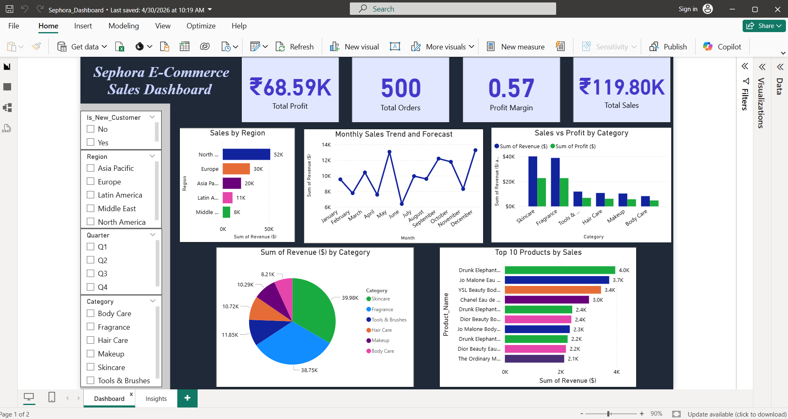
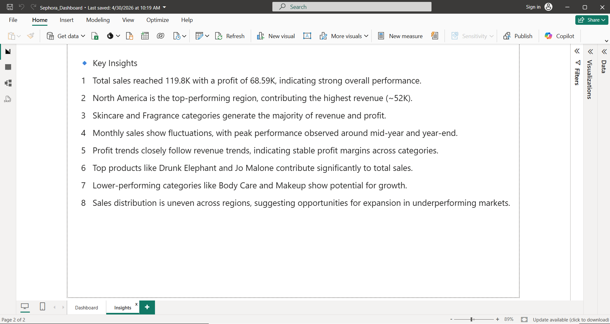

# Sephora E-Commerce Sales Dashboard

## Project Overview

This project presents an interactive Power BI dashboard designed to analyze Sephora e-commerce sales performance across regions, categories, products, and time periods.

The dashboard provides a consolidated view of sales, profit, orders, regional performance, category performance, monthly sales trends, and top-performing products.

## Objective

The objective of this project is to transform e-commerce sales data into meaningful visual insights that can support performance analysis and business decision-making.

## Dataset

The dataset contains 500 e-commerce orders with information related to:

- Order details and dates
- Products, brands, and categories
- Sales, cost, profit, and profit margin
- Regions and countries
- Customer information
- Quantity and discounts
- Payment and shipping details
- Customer ratings
- New and returning customers

## Tools Used

- Power BI
- Microsoft Excel

## Dashboard Features

- KPI cards for Total Sales, Total Profit, Total Orders, and Profit Margin
- Sales performance by region
- Monthly sales trend and forecast
- Sales and profit comparison by category
- Revenue distribution across categories
- Top 10 products by sales
- Interactive filters for Customer Type, Region, Quarter, and Category

## Key Insights

- Total sales reached ₹119.80K with total profit of ₹68.59K.
- North America generated the highest regional revenue at approximately ₹52K.
- Skincare and Fragrance were the leading revenue-generating categories.
- Monthly sales showed fluctuations, with strong performance around the middle and end of the year.
- Top products such as Drunk Elephant and Jo Malone contributed significantly to total sales.
- Lower-performing categories such as Body Care and Makeup showed potential for growth.
- Sales distribution varied across regions, highlighting differences in regional performance.

## Dashboard Preview

Main Dashboard

Key Insights

## Repository Contents

- `dashboard/` — Power BI dashboard file
- `data/` — Excel dataset used for analysis
- `screenshots/` — Dashboard and key insights previews
